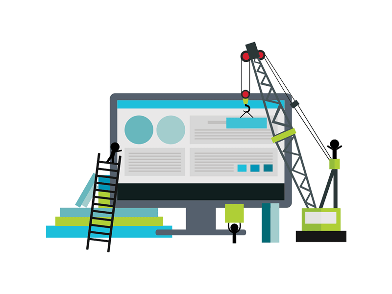
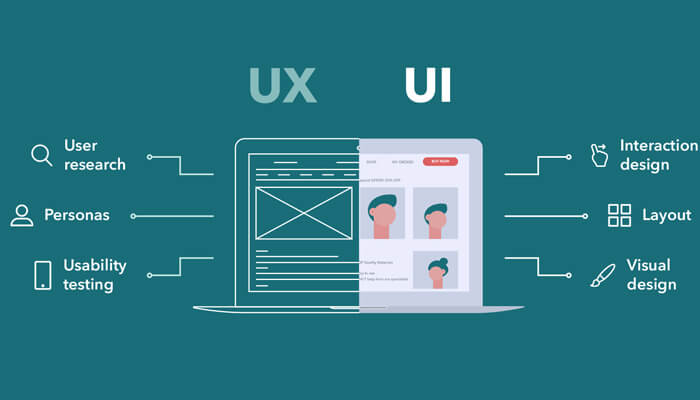
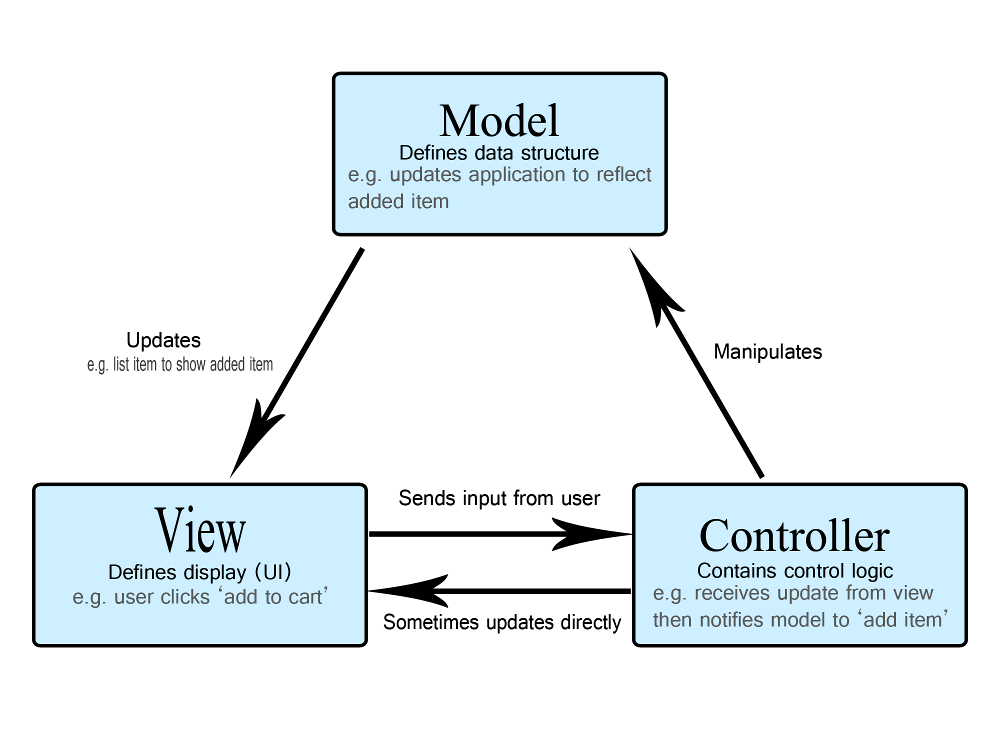
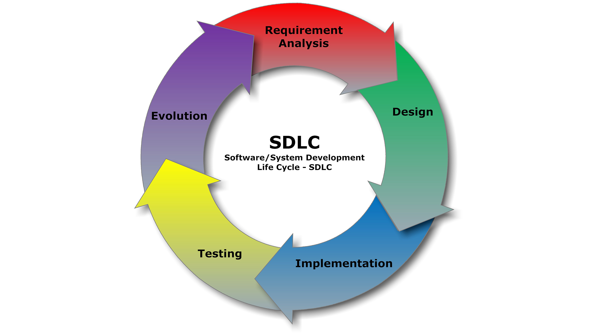

# ¿Qué es FrontEnd?

## ¿Qué significa Front?

cuando hablamos de Front nos referimos a la parte de "en frente" de las aplicaciones web, la cual es la capa en la que interactuan los usuarios. 

Esta es la parte que se visualiza en el navegador y es la que manda toda la informacion al Backend para ser procesada. 

Asi como se muestra en la imagen, en el FrontEnd contruimos todo el diseño del sitio; desde la estructura, el acomodo, la distribucióm de contenido, los estilos que se muestran y los flujos de interacción con nuestros usuarios. 

## El usuario
Cuando programamos en frontEnd tenemos que estar concientes de que todo lo que haceemos será lo que la persona al otro lado de la pantalla usará, y esta persona es en la que nos tenemos que enfocar. 

Para eso existe el UI-UX, el cual se refiere a User Interface (Interfaz de usuario) y User experience(Experiencia de usuario), estas son las partes más importantes del diseño de una web, y SIEMPRE se tienen que realizar antes de empezar a programar. 

## Patrones de arquitectura de desarrollo Web

MVC (Model View Controller)

Hablaremos de uno de los patrones de diseño web mas utilizados y con el cual podremos tener muchisimo más claro el funcionamiento de todo el FrontEnd, la parte a la que nos referimos para el Front es la parte de la "Vista"

MVC se refiere a la separación de la interfaz de usuario (Vista) de la parte de datos y de negocio (Modelo), la cual está intermediada por un controlador (Controller); el controlador realiza las validaciones, sanitizaciones de datos, manejo de errores, entre varias otras cosas que permiten que los datos que se mandan desde la vista, lleguen de forma más ordenada y limpia a su procesamiento en el backend que es donde se encuentra el modelo.

Así como estre patrón de diseño arquitectónico existen algunos otros como MVVM (Model View View Model), MVP (Model View Presenter), RMR (Resource Method Representation) y se recomienda que utilices el que sea mejor para tu aplicacion. 

# SDLC (Software Development Life Cycle)

El ciclo de vidad del desarrollo de software es algo que debemos tomar en cuenta siempre que vayamos a hacer una aplicación, así sea un proyecto personal, un trabajo o cualquier momento en el que desarrollemos software.

En el SDLC tenemos las diferentes fases que harán que nuestro desarrollo sea mucho más controlado y sobre todo escalable y mantenible.

+ Fase 1: Requerimientos --> Fase donde se presentan las necesidades de la aplicación. 
+ Fase 2: Diseño --> En esta fase los requerimientos se convierten en un plan y lo que debería de parecer la aplicación o producto final.
+ Fase 3: Desarrollo --> En esta fase se hace la programación de las palicaciones, aquí es donde metemos el código con las mejores prácticas y con y con las reglas de las guías de desarrollo seguro.
+ Fase 4: Verificación --> En esta fase revisarás y confirmaras que las buenas prácticas se aplicaron en el código. En esta parte se integran las pruebas CI/CD e integración de pruebas unitarias. 
+ Fase 5: Mantenimiento  y evaluación --> Los sistemas son un ente vivo y por lo tanto tiene que mantenerse en continuo movimiento.  